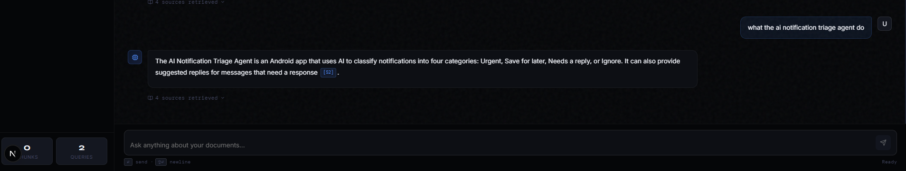
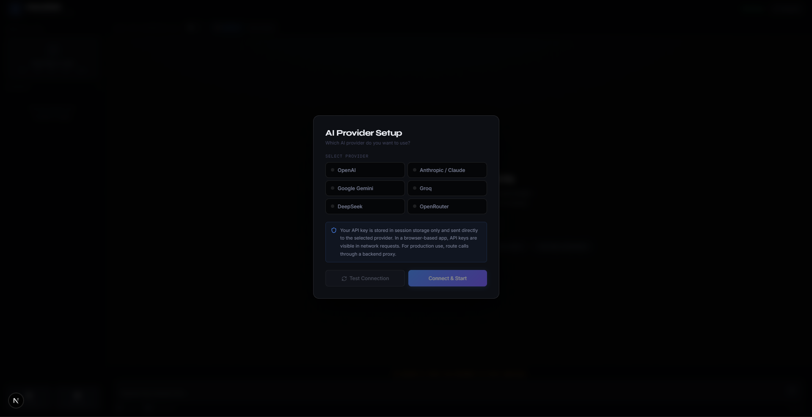
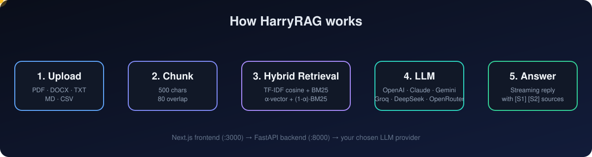

<div align="center">


<a href="https://github.com/harisaltaf151-bit/rag-engine">
  
</a>

<br/>


</div>

---

## ✨ What is HarryRAG?

HarryRAG is a **personal document intelligence app**. Upload your own files, ask questions in plain English, and get answers that point back to the exact source chunks they came from.

No external vector database needed. Retrieval is pure Python, and you choose which LLM answers your questions.

---

## 🖼 Screenshots

<table>
  <tr>
    <td align="center"><b>Chat with cited sources</b></td>
    <td align="center"><b>Pick your AI provider</b></td>
  </tr>
  <tr>
    <td></td>
    <td></td>
  </tr>
</table>

---

## 🚀 Features

| | Feature | Details |
|---|---|---|
| 📄 | **Multi-format upload** | PDF, DOCX, TXT, MD, CSV |
| 🔎 | **Hybrid retrieval** | TF-IDF cosine similarity fused with BM25 keyword scoring |
| 📌 | **Cited answers** | Every claim links to `[S1]`, `[S2]`... source chunks |
| ⚡ | **Streaming** | Real-time token streaming, toggle on or off |
| 🔌 | **6 providers** | OpenAI, Anthropic, Gemini, Groq, DeepSeek, OpenRouter |
| 🎛 | **Tunable** | Adjustable Top-K, model picker, hybrid on/off |
| 🔐 | **Key safety** | API key lives in `sessionStorage` only |

---

## 🏗 How it works



<details>
<summary><b>Detailed flow (click to expand)</b></summary>

```
User Query
    │
    ▼
Next.js Frontend (port 3000)
    │  POST /api/backend/query
    ▼
FastAPI Backend (port 8000)
    │
    ├─ 1. Extract & chunk uploaded docs
    │       └─ PDF (pypdf) / DOCX / CSV / TXT / MD
    │
    ├─ 2. Hybrid Retrieval
    │       ├─ TF-IDF vector similarity (cosine)
    │       └─ BM25 keyword scoring
    │       └─ Weighted fusion: α·vector + (1-α)·BM25
    │
    ├─ 3. Context assembly → system prompt
    │       └─ [Source N | filename | chunk idx] format
    │
    └─ 4. LLM provider (streaming or batch)
            └─ Returns cited answer → frontend
```

</details>

---

## ⚡ Quick Start

**Prerequisites:** Python 3.10+, Node.js 18+, and an API key from any supported provider.

### Mac / Linux / Git Bash / WSL

```bash
bash start.sh
```

### Windows (PowerShell, two terminals)

**Terminal 1: Backend**

```powershell
cd backend
python -m venv venv
.\venv\Scripts\Activate.ps1
pip install -r requirements.txt
copy .env.example .env
uvicorn main:app --reload --port 8000
```

**Terminal 2: Frontend**

```powershell
cd frontend
npm install
npm run dev
```

Open **http://localhost:3000**, choose a provider, paste your key, click **Test Connection**, then **Connect & Start**.

> 💡 Free options: [Groq](https://console.groq.com) and [OpenRouter](https://openrouter.ai) (free models available).

---

## 📁 Project Structure

```
rag-engine/
├── start.sh                  ← One-command launcher (bash)
├── docs/                     ← README images
├── backend/
│   ├── main.py               ← FastAPI app (upload, retrieval, LLM calls)
│   ├── requirements.txt
│   └── .env.example          ← Copy to .env
└── frontend/
    ├── src/
    │   ├── app/
    │   │   ├── page.tsx      ← Full chat UI
    │   │   ├── layout.tsx
    │   │   └── globals.css
    │   └── lib/
    │       └── api.ts        ← Backend API client
    ├── next.config.js        ← Proxies /api/backend/* → :8000
    └── package.json
```

---

## 📡 API Reference

| Method | Route | Description |
|--------|-------|-------------|
| `GET` | `/health` | Backend health check |
| `POST` | `/upload` | Upload a document (multipart) |
| `GET` | `/documents` | List all documents + chunk counts |
| `DELETE` | `/document/{doc_id}` | Remove a document |
| `POST` | `/query` | RAG query (supports `stream: true`) |

Interactive docs: **http://localhost:8000/docs**

---

## 🔧 Configuration

| Option | Default | Description |
|--------|---------|-------------|
| Provider / Model | Selectable in UI | Any model from the supported providers |
| Top-K | 4 | Chunks retrieved per query |
| Hybrid Search | ON | Vector + BM25 fusion |
| Streaming | OFF | Real-time token streaming |
| Chunk size | 500 chars | Edit `CHUNK_SIZE` in `main.py` |
| Chunk overlap | 80 chars | Edit `CHUNK_OVERLAP` in `main.py` |

---

## 📦 Production Upgrades

| Component | Current | Production |
|-----------|---------|------------|
| Vector store | In-memory TF-IDF | Qdrant / Pinecone / pgvector |
| Document store | Python dict | PostgreSQL |
| Auth | None | NextAuth.js / Clerk |
| File storage | Memory | S3 / Cloudflare R2 |
| Embeddings | TF-IDF | `sentence-transformers` / OpenAI |
| API keys | Browser session | Server-side proxy |

---

## 🐛 Troubleshooting

<details>
<summary><b>Backend not starting / port 8000 busy</b></summary>

```powershell
# Windows
netstat -ano | findstr :8000
taskkill /PID <PID> /F
```

```bash
# Mac / Linux
lsof -i :8000
kill -9 <PID>
```

</details>

<details>
<summary><b>Module not found errors</b></summary>

```powershell
cd backend
.\venv\Scripts\Activate.ps1
pip install -r requirements.txt
```

</details>

<details>
<summary><b>PowerShell blocks the activate script</b></summary>

```powershell
Set-ExecutionPolicy -Scope CurrentUser RemoteSigned
```

</details>

<details>
<summary><b>CORS errors or API errors</b></summary>

- Backend must run on `:8000` and frontend on `:3000`. The `next.config.js` proxy handles CORS.
- Make sure the provider you selected matches your API key.
- Use **Test Connection** in the setup screen to verify the key.

</details>

---

<div align="center">

### 👤 Built by Muhammad Haris

[](https://github.com/harisaltaf151-bit)

⭐ **If you like this project, give it a star!** ⭐

</div>
